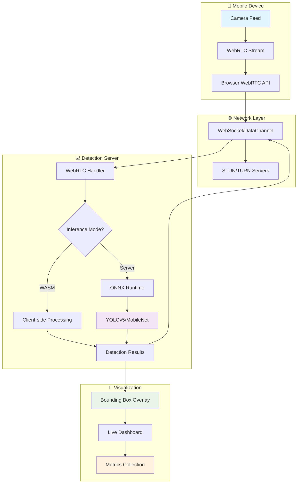
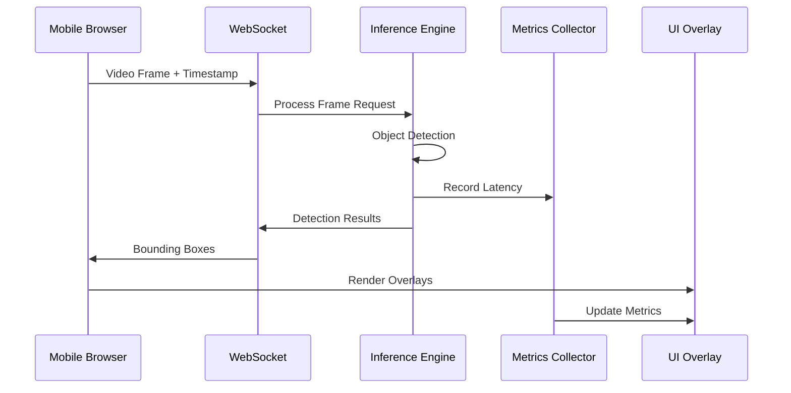

# 🚀 WebRTC VLM Multi-Object Detection System

<div align="center">


**Real-time multi-object detection system with live video streaming from mobile devices**

[🎯 Quick Start](#-quick-start-one-command) • [📱 Demo](#-live-demo) • [🔧 Installation](#-installation--setup) • [📊 Benchmarks](#-benchmarking--metrics) • [🏗️ Architecture](#-system-architecture)

</div>

---

## 📋 Table of Contents

- [🎯 Quick Start](#-quick-start-one-command)
- [✨ Features](#-features)
- [🏗️ System Architecture](#-system-architecture)
- [📱 Live Demo](#-live-demo)
- [🔧 Installation & Setup](#-installation--setup)
- [🧠 Inference Modes](#-inference-modes)
- [📊 Benchmarking & Metrics](#-benchmarking--metrics)
- [📱 Mobile Connection Methods](#-mobile-connection-methods)
- [🛠️ Development](#-development)
- [🔍 Troubleshooting](#-troubleshooting)
- [📈 Performance Optimization](#-performance-optimization)
- [🤝 Contributing](#-contributing)
- [📄 License](#-license)

---

## 🎯 Quick Start (One Command)

```bash
# 🚀 Clone and start the demo instantly
git clone <repo-url>
cd webrtc-vlm-detection
chmod +x start.sh
./start.sh
```

**Then:**
1. 💻 Open `http://localhost:3000` on your laptop
2. 📱 Scan QR code with your phone camera
3. ✅ Allow camera access → see live object detection!

---

## ✨ Features

<div align="center">

| 🎥 **Real-time Streaming** | 🧠 **AI Detection** | 📱 **Mobile First** | ⚡ **High Performance** |
|:---:|:---:|:---:|:---:|
| WebRTC live video | YOLO/MobileNet models | Browser-based | 10-30 FPS processing |
| Sub-100ms latency | 80+ object classes | No app required | Adaptive quality |

</div>

### 🌟 Core Capabilities

- **🎯 Real-time Object Detection**: Detect 80+ object classes with bounding boxes and confidence scores
- **📱 Mobile WebRTC Streaming**: Direct browser-to-browser video streaming from any mobile device
- **⚡ Dual Inference Modes**: Client-side WASM or server-side ONNX processing
- **📊 Live Metrics Dashboard**: Real-time latency, FPS, and bandwidth monitoring
- **🔄 Adaptive Quality**: Dynamic resolution and frame rate adjustment
- **🌐 Network Flexibility**: Local network or external access via ngrok
- **🐳 Docker Ready**: One-command deployment with Docker Compose
- **📈 Benchmarking Suite**: Comprehensive performance analysis tools

---

## 🏗️ System Architecture



### 🔄 Data Flow Architecture



---

## 📱 Live Demo

### 🎥 Demo Flow

1. **📷 Camera Capture**: Mobile device streams live video via WebRTC
2. **🔄 Real-time Processing**: AI models detect objects in each frame
3. **🎯 Overlay Rendering**: Bounding boxes drawn on live video feed
4. **📊 Metrics Display**: Live performance statistics

### 🖼️ Screenshot Preview

```
┌─────────────────────────────────────────┐
│  📱 WebRTC VLM Object Detection         │
│  ┌─────────────────────────────────────┐ │
│  │     🎥 Live Video Feed              │ │
│  │  ┌─────────┐  ┌─────────┐          │ │
│  │  │ person  │  │   car   │          │ │
│  │  │  0.94   │  │  0.87   │          │ │
│  │  └─────────┘  └─────────┘          │ │
│  └─────────────────────────────────────┘ │
│                                         │
│  📊 Metrics: 45ms latency | 15 FPS      │
│  🔍 Objects: person, car, bicycle       │
└─────────────────────────────────────────┘
```

---

## 🔧 Installation & Setup

### 📋 Prerequisites

<table>
<tr>
<td>

**🐳 Docker Environment**
- Docker Engine 20.10+
- Docker Compose 2.0+
- 4GB+ available RAM

</td>
<td>

**💻 Development Setup**
- Python 3.9+
- Node.js 16+
- Modern browser (Chrome/Safari)

</td>
</tr>
</table>

### 🚀 Installation Methods

#### Method 1: Docker (Recommended)

```bash
# 📦 Quick Docker setup
git clone <repo-url>
cd webrtc-vlm-detection
docker-compose up --build
```

#### Method 2: Local Development

```bash
# 🛠️ Local development setup
git clone <repo-url>
cd webrtc-vlm-detection

# Backend setup
python -m venv .venv
source .venv/bin/activate  # Windows: .venv\Scripts\activate
pip install -r requirements.txt

# Start server
python server/main.py
```

### 🔐 SSL Certificate Setup

```bash
# 🔒 Generate SSL certificates for HTTPS (required for mobile camera access)
python generate_cert.py
```

---

## 🧠 Inference Modes

<div align="center">

| Mode | 🎯 Use Case | 💻 Requirements | ⚡ Performance | 🎚️ Quality |
|:---:|:---:|:---:|:---:|:---:|
| **WASM** | Low-resource laptops | 8GB RAM, Intel i5 | 10-15 FPS | Good |
| **Server** | High-performance setup | 16GB RAM, Modern CPU | 20-30 FPS | Excellent |

</div>

### 🔧 WASM Mode (Default)

```bash
# 🌐 Client-side inference in browser
./start.sh --mode wasm

# ✅ Benefits:
# • Works on modest laptops (Intel i5, 8GB RAM)
# • ~10-15 FPS processing at 320×240 resolution
# • CPU usage: 15-25%
# • No server-side GPU required
```

### 🚀 Server Mode

```bash
# 🖥️ Server-side ONNX inference
./start.sh --mode server

# ✅ Benefits:
# • Better accuracy and performance
# • Higher resolution processing
# • CPU usage: 30-50%
# • Automatic model download
```

### ⚙️ Configuration Options

```bash
# 🎛️ Advanced configuration
export DETECTION_ENGINE=yolo          # yolo, mobilenet, gemini
export CONFIDENCE_THRESHOLD=0.5       # Detection confidence
export MAX_DETECTIONS=8               # Max objects per frame
export DETECTION_INTERVAL=2000        # Detection interval (ms)
```

---

## 📊 Benchmarking & Metrics

### 🏃‍♂️ Running Benchmarks

```bash
# ⏱️ Quick 30-second benchmark
./bench/run_bench.sh --duration 30 --mode wasm

# 🚀 Server mode benchmark
./bench/run_bench.sh --duration 60 --mode server

# 📁 Custom output file
./bench/run_bench.sh --duration 30 --output my_results.json
```

### 📈 Metrics Output

The benchmark generates `metrics.json` with comprehensive performance data:

```json
{
  "summary": {
    "median_latency_ms": 45,
    "p95_latency_ms": 89,
    "processed_fps": 15.2,
    "total_frames": 456,
    "duration_seconds": 30
  },
  "network": {
    "uplink_kbps": 1250,
    "downlink_kbps": 850,
    "packet_loss_percent": 0.1
  },
  "system": {
    "cpu_usage_percent": 23.5,
    "memory_usage_mb": 512,
    "gpu_usage_percent": 0
  }
}
```

### 📊 Performance Benchmarks

<table>
<tr>
<th>💻 System Specs</th>
<th>🧠 Mode</th>
<th>⚡ FPS</th>
<th>⏱️ Latency (P95)</th>
<th>🔋 CPU Usage</th>
</tr>
<tr>
<td>Intel i5, 8GB RAM</td>
<td>WASM</td>
<td>12-15</td>
<td>85ms</td>
<td>20-25%</td>
</tr>
<tr>
<td>Intel i7, 16GB RAM</td>
<td>Server</td>
<td>25-30</td>
<td>45ms</td>
<td>35-45%</td>
</tr>
<tr>
<td>M1 MacBook Pro</td>
<td>Server</td>
<td>30-35</td>
<td>35ms</td>
<td>25-35%</td>
</tr>
</table>

---

## 📱 Mobile Connection Methods

### 🏠 Method 1: Local Network (Recommended)

```bash
# 🌐 Default local network mode
./start.sh
```

**📋 Requirements:**
- 📶 Phone and laptop on same WiFi network
- 🔗 Open displayed URL: `http://192.168.x.x:3000`
- ✅ Most reliable connection method

### 🌍 Method 2: External Access (Fallback)

```bash
# 🚇 Use ngrok tunnel for external access
./start.sh --ngrok
```

**📋 Features:**
- 🌐 Works from any network
- 🔗 Displays public URL for phone access
- 🆓 Uses free ngrok tier

### 📱 Mobile Browser Support

| 📱 Platform | 🌐 Browser | ✅ Support Level | 📝 Notes |
|:---:|:---:|:---:|:---:|
| **Android** | Chrome 90+ | Full | Recommended |
| **Android** | Firefox 88+ | Good | Some WebRTC limitations |
| **iOS** | Safari 14+ | Good | iOS WebRTC restrictions |
| **iOS** | Chrome | Limited | Uses Safari engine |

---

## 🛠️ Development

### 🏗️ Project Structure

```
webrtc-vlm-detection/
├── 📁 server/                 # Python backend
│   ├── main.py               # Main server application
│   ├── webrtc_handler.py     # WebRTC connection handling
│   ├── inference_engine.py   # AI model inference
│   └── metrics_collector.py  # Performance metrics
├── 📁 static/                # Frontend assets
│   ├── app.js               # Main application logic
│   ├── detection.js         # Object detection handling
│   └── index.html           # Web interface
├── 📁 models/                # AI models
│   └── yolov5n.onnx         # YOLO model file
├── 📁 bench/                 # Benchmarking tools
├── 📁 certs/                 # SSL certificates
├── 🐳 docker-compose.yml     # Docker configuration
├── 🚀 start.sh              # Launch script
└── 📋 requirements.txt       # Python dependencies
```

### 🔧 Development Commands

```bash
# 🛠️ Development server with hot reload
python server/main.py --debug

# 🧪 Run tests
pytest tests/

# 📊 Generate metrics
python -m server.metrics_collector

# 🔍 Lint code
flake8 server/
eslint static/
```

### 🔌 API Endpoints

| 🛣️ Endpoint | 📝 Method | 📋 Description |
|:---:|:---:|:---:|
| `/` | GET | Main dashboard |
| `/ws` | WebSocket | Real-time communication |
| `/api/metrics` | GET | Current metrics |
| `/api/config` | GET | System configuration |
| `/qr` | GET | QR code generation |

---

## 🔍 Troubleshooting

### 🚨 Common Issues & Solutions

<details>
<summary>📱 <strong>Phone Won't Connect</strong></summary>

**🔧 Solutions:**
1. ✅ Ensure phone and laptop are on same WiFi network
2. 🔒 Check if HTTPS is enabled (required for camera access)
3. 🌐 Try ngrok mode: `./start.sh --ngrok`
4. 🔥 Disable firewall temporarily
5. 📱 Use Chrome on Android (best compatibility)

</details>

<details>
<summary>🎯 <strong>Overlays Misaligned</strong></summary>

**🔧 Solutions:**
1. ⏰ Confirm timestamps are in milliseconds
2. 🔄 Check frame ID synchronization
3. 📐 Verify coordinate normalization [0..1]
4. 🖥️ Test on different screen resolutions

</details>

<details>
<summary>🔥 <strong>High CPU Usage</strong></summary>

**🔧 Solutions:**
1. 📉 Reduce resolution to 320×240
2. 🔄 Switch to WASM mode
3. ⏱️ Increase detection interval
4. 🎯 Lower confidence threshold
5. 📊 Limit max detections per frame

</details>

<details>
<summary>🐳 <strong>Docker Issues</strong></summary>

**🔧 Solutions:**
1. 🔄 Update Docker to latest version
2. 💾 Increase Docker memory allocation
3. 🧹 Clean Docker cache: `docker system prune`
4. 🔍 Check logs: `docker-compose logs`

</details>

### 🛠️ Debug Tools

```bash
# 🔍 WebRTC debugging
# Open Chrome: chrome://webrtc-internals/

# 📊 Network monitoring
netstat -i  # Interface statistics
iftop       # Real-time bandwidth usage

# 💻 System monitoring
htop        # CPU and memory usage
nvidia-smi  # GPU usage (if available)
```

---

## 📈 Performance Optimization

### ⚡ Optimization Strategies

<div align="center">

| 🎯 Area | 🔧 Optimization | 📊 Impact |
|:---:|:---:|:---:|
| **🖼️ Resolution** | 320×240 → 640×480 | 2x processing time |
| **⏱️ Frame Rate** | 30fps → 15fps | 50% CPU reduction |
| **🧠 Model Size** | YOLOv5s → YOLOv5n | 3x speed increase |
| **🔄 Batch Size** | 1 → 4 frames | 20% efficiency gain |

</div>

### 🎛️ Configuration Tuning

```bash
# ⚡ Performance-focused configuration
export DETECTION_INTERVAL=3000        # Reduce detection frequency
export CONFIDENCE_THRESHOLD=0.7       # Higher confidence = fewer false positives
export MAX_DETECTIONS=5               # Limit objects per frame
export FRAME_SKIP=2                   # Process every 2nd frame
```

### 🔄 Adaptive Quality System

The system automatically adjusts quality based on:
- 💻 **CPU Usage**: Reduces resolution when CPU > 80%
- 🌐 **Network Latency**: Adjusts frame rate for high latency
- 📱 **Device Capabilities**: Optimizes for mobile vs desktop
- 🔋 **Battery Level**: Reduces processing on low battery

---

## 🤝 Contributing

### 🚀 Getting Started

1. 🍴 Fork the repository
2. 🌿 Create a feature branch: `git checkout -b feature/amazing-feature`
3. 💾 Commit changes: `git commit -m 'Add amazing feature'`
4. 📤 Push to branch: `git push origin feature/amazing-feature`
5. 🔄 Open a Pull Request

### 📋 Development Guidelines

- ✅ Follow PEP 8 for Python code
- 📝 Add docstrings to all functions
- 🧪 Include tests for new features
- 📊 Update benchmarks for performance changes
- 📚 Update documentation

### 🐛 Bug Reports

Please include:
- 💻 System specifications
- 🌐 Browser and version
- 📱 Mobile device details
- 🔍 Steps to reproduce
- 📊 Performance metrics

---

## 📄 License

This project is licensed under the MIT License - see the [LICENSE](LICENSE) file for details.

---

## 🙏 Acknowledgments

- 🧠 **YOLO Team**: For the excellent object detection models
- 🌐 **WebRTC Community**: For real-time communication standards
- 🐳 **Docker**: For containerization platform
- 📊 **ONNX Runtime**: For cross-platform inference
- 🎨 **Contributors**: All the amazing people who helped build this

---

<div align="center">

**⭐ Star this repo if you found it helpful!**

[🔝 Back to Top](#-webrtc-vlm-multi-object-detection-system)

</div>

---

## 📊 Project Status


**🎯 Current Version**: 1.0.0  
**📅 Last Updated**: December 2024  
**🔄 Status**: Active Development  

---

## 🔮 Roadmap

- [ ] 🎯 **Multi-model Support**: Add support for custom ONNX models
- [ ] 🌐 **WebAssembly Optimization**: Improve WASM performance
- [ ] 📱 **Mobile App**: Native mobile application
- [ ] 🤖 **AI Enhancement**: Advanced object tracking
- [ ] ☁️ **Cloud Deployment**: AWS/GCP deployment guides
- [ ] 📊 **Analytics Dashboard**: Advanced metrics visualization

---

*Built with ❤️ for the computer vision community*